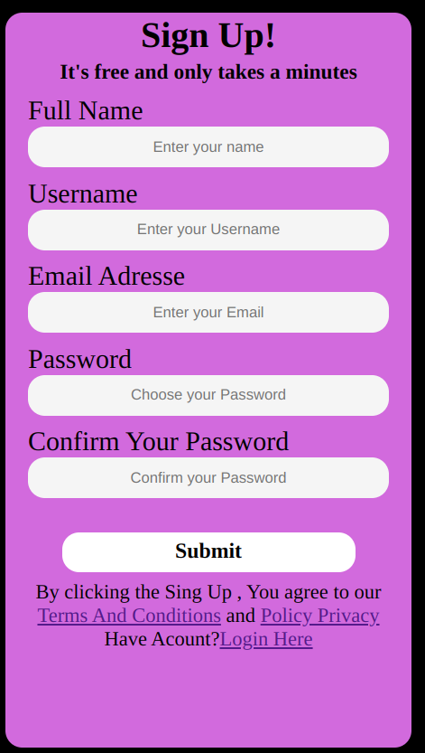
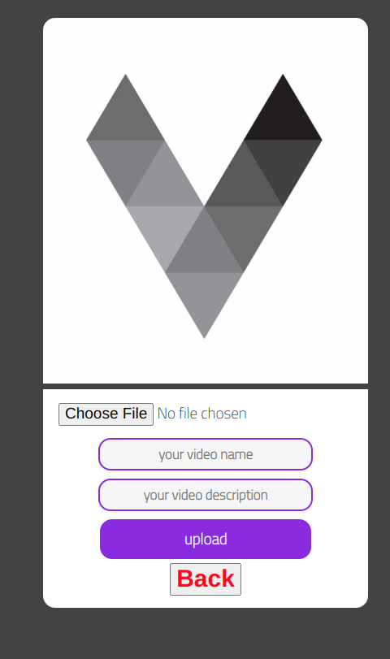
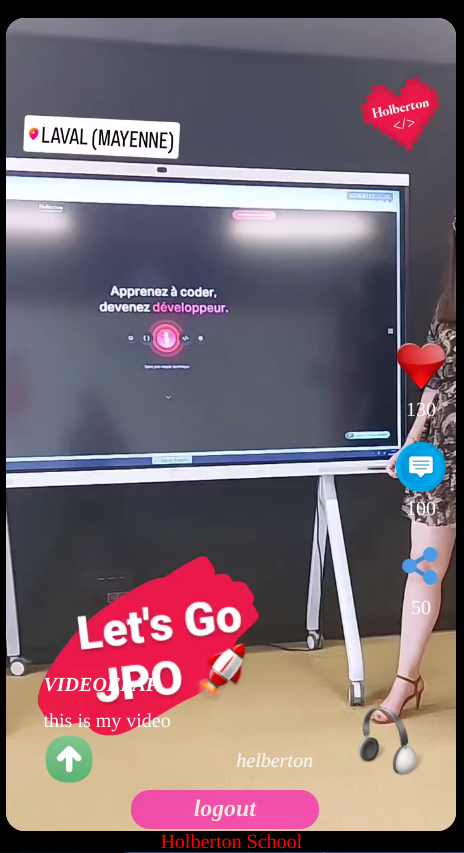

# VIDEOFLAP Landing Page

This is a landing page for VIDEOFLAP, a project aimed at providing a platform for users to express their rhythm and create their stories through video content.

## Introduction

The landing page introduces VIDEOFLAP with a large cover image and a catchy phrase: "Express your rhythm, create your story". You can also watch a demo video of the project by clicking on the "Video demo" link in the header.

## Key Features

VIDEOFLAP highlights three key features:

1. **Registration**:
   - Users can register for an account to access the platform's features.
   - 

2. **Upload Video**:
   - Registered users can upload videos to share their content with the community.
   - 

3. **Live Video**:
   - The platform supports live video streaming for real-time interaction.
   - 

## About

This project was inspired by the desire to create a platform where users can share their creativity through video content. As a Portfolio Project for Holberton School, this project showcases the skills and knowledge acquired during the course.

### Meet the Team

- [LinkedIn](https://linkedin.com)
- [GitHub](https://github.com/idoudi2020)
- [Twitter](https://twitter.com)

### GitHub Repository

[Visit Repository](https://github.com/idoudi2020/idoudi2020.github.io)

## Deployment

You can access the deployed project by clicking on the "Visit Project" button in the header.

## License

&copy; 2024 VIDEOFLAP. All rights reserved.
